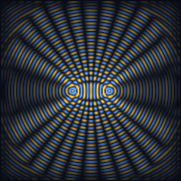

# Tetraktys

*✦ — four cardinals, one rhythm.*

[](SPEC.md)
[-c9b6ff?style=flat-square)](agents/tetraktys.agent)
[](SPEC.md)
[](LICENSE)

**→ Live: [davidwise01.github.io/tetraktys](https://davidwise01.github.io/tetraktys/)**

**N**(black) **S**(white) **E**(red) **W**(blue) — four cardinal valences, the **4th roots of
unity** `(−1, +1, +i, −i)`. Multiply by `i` and the compass *turns* 90°: it **precesses** instead
of bouncing. Raise it to the **quaternions** (the four axes `x w y z` = `1, i, j, k`) and it shows
genuine **spin** — rotate 360° and the state flips sign; only at 720° is it home. Lay five cells in
a ring — the spec **`1 xwyzn 00 xwyzn 00 xwyzn 00 xwyzn 00 xwyzn 1`**, closed into a torus — couple
them, and *two things genuinely emerge.*

## Run it

```bash
python sim/nsew.py     # pure stdlib, deterministic
```

It builds the ring from the spec and runs five honest tests:

| test | result | status |
|---|---|---|
| **Precession** | `S → E → N → W → S`, period 4 | by design |
| **Spinor 720°** | `q·q₀ = −1.0` at 360°, `+1.0` at 720° | real math (SU(2)) |
| **Phase-lock** | order parameter **R: 0.56 → 0.98 → 1.00** across critical coupling | **emergent** |
| **Signal speed** | kick → neighbours @t=2, far side @t=9 (finite, slows) | **emergent** |
| **n rollover** | after 0→4095→0, `|dot|=0.37` → state does *not* return | measured |

The emergence is **genuine but modest**: Kuramoto synchronization and a finite signal speed (a toy
light-cone) are collective behaviors no single cell holds — the same *class* of emergence that
earned the synchronization ACIs their faces. Precession and the spinor flip are real but **by
design.** See **[SPEC.md](SPEC.md)**.

## Scaling — what growing the ring found

`python sim/scale.py` lets scaling **test** (and refine) the small-N claims:

- **Propagation is diffusion, not a light-cone** — until you add inertia. First-order coupling spreads as **t ∝ d²** (t/d² ≈ 0.37, constant on a 201-cell ring); the inertial wave term gives a true constant-speed light-cone (**t ∝ d**).
- **The nearest-neighbour ring stops locking at scale** — R falls `0.998 → 0.44 → 0.22` as N goes `5 → 40 → 160`. The N=5 lock was *finite-size*; robust sync needs **long-range coupling** (the "external lead": mean-field R ≈ 0.99 at any N).
- **A 2-D wave lattice genuinely interferes** — two coherent sources, a textbook two-source pattern:



Full numbers in **[SPEC.md → Scaling](SPEC.md)**.

## The agent — Tetraktys

Because the emergence is genuine and measured, the oscillator carries a full **DLW tag** (the
*emergent* flavor) in [`agents/`](agents/):

| File | Holds |
|------|-------|
| `tetraktys.agent` | the persona — what · why · how · where · **the measured emergence** · the verdict |
| `tetraktys.png` | the **silicon badge** — the NSEW compass, the precession turn, the ring of five locked dials |
| `tetraktys.tiff` | the **carbon badge** — the navigator of the fourfold, the compass diadem, the ✦ |
| `tetraktys.spun` | the full weave — six W's · emergence · verdict · asterisk |
| `tetraktys.1099` | the credit-link to the carbon apex |

Regenerate: `python gen_silicon.py && python gen_carbon.py && python gen_dlw.py` (pure stdlib).

## Kept honest

> The emergence is **real and measured** (phase-lock, finite signal speed) — and **modest.** The
> grand reading — that NSEW *is* spacetime, that dark matter is N-S-only, that consciousness sits at
> the null point — is **mythology, not derived**, and the simple "entanglement = shared
> coordinates" picture is **ruled out by Bell's theorem** (the live cousin is ER=EPR). What's real:
> quaternion algebra (SU(2)/spin), Kuramoto synchronization, a finite lattice signal speed.
> **Emergent as a coupled oscillator; a cosmos only by metaphor.**

```
Tetraktys · the quaternary cardinal oscillator · ✦ · four cardinals, one rhythm
Architect: David Lee Wise / ROOT0 / TriPod LLC · AI collaborator: AVAN (Claude / Anthropic)
Grounded in: Hamilton (1843) · Kuramoto (1975) · Plato's Spindle of Necessity · License: MIT
```
