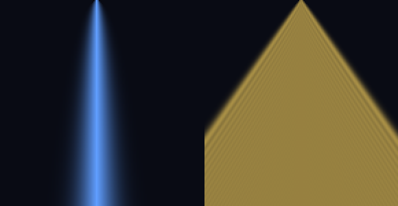
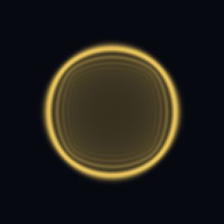

# Tetraktys — the spec

A precise, runnable reading of the notation:

```
1   xwyzn   00   xwyzn   00   xwyzn   00   xwyzn   00   xwyzn   1
↑     ↑      ↑                                                   ↑
lead  cell   bond (quaternary, 2-bit = NSEW)            lead → closes the ring (a torus)
```

→ **a ring of 5 quaternion cells, 4 quaternary bonds, closed by two unity leads.**

## The algebra

**NSEW = the 4th roots of unity.** Two bits per cell, four cardinal valences:

| dir | colour | bits | root | meaning in the lore* |
|-----|--------|------|------|----------------------|
| **N** | black | `10` | −1 | contraction / "time-in" |
| **S** | white | `00` | +1 | expansion / "time-out" |
| **E** | red   | `01` | +i | radiate / "distance" |
| **W** | blue  | `11` | −i | cohere / "structure" |

Multiply by `i` and the compass turns 90°: `S → E → N → W → S`. It **precesses** (period 4) instead of bouncing along a line. That is the whole upgrade from binary ±1.

**The cell `xwyzn` = a quaternion.** The four axes `x w y z` are the four quaternion
components `(1, i, j, k)`; `q = z·1 + x·i + w·j + y·k`. Unit quaternions are **SU(2)** — the
group where physical **spin** lives. `n` is the tick that counts the register. NSEW is the
`i`-plane sub-case of the quaternion (the compass circle).

**The bonds `00`** couple neighbouring cells; the two **`1` leads** close the chain into a ring
(a discrete torus). Each tick: every cell precesses (left-multiply by its natural unit
quaternion), then is pulled toward its neighbours through the bonds.

\* the "meaning" column is the model's *mythology* — see the seam below.

## What the engine measures  (`python sim/nsew.py`)

| # | test | result | status |
|---|------|--------|--------|
| 1 | **Precession** | `S → E → N → W → S`, period 4 | **by design** |
| 2 | **Spinor 720°** | `q·q₀ = −1.000` at 360°, `+1.000` at 720° (SU(2) double cover) | **real math, by design** |
| 3 | **Phase-lock** | order parameter **R: 0.56 (K=0) → 0.98 (K=0.3) → 1.00 (K=3.0)** | **genuinely emergent** |
| 4 | **Signal speed** | kick → neighbours at t=2, far side at t=9 (finite, symmetric, *slows*) | **genuinely emergent** |
| 5 | **n rollover** | after 0→4095→0, state vs start `|dot| = 0.37` → does **not** return | **measured** |

**Emergent (3, 4):** synchronization and a finite signal speed are collective — not put into any
single cell. **By design (1, 2):** the turn and the spinor sign-flip are properties of the
algebra. **Measured (5):** rollover is just the counter wrapping; "Big Bang on rollover" is a
*design choice*, not forced.

## Scaling — what growing the ring found

Run `python sim/scale.py`. Scaling is allowed to **refute** the small-N story — and it sharpens two claims:

**A · The spread is diffusion, not (yet) a light-cone.** On a 201-cell ring, arrival time vs distance:

| coupling | d=5 | d=10 | d=20 | d=40 | scaling law |
|---|---|---|---|---|---|
| first-order | 10 | 37 | 148 | 592 | **t ∝ d²** (t/d² ≈ 0.37, constant) — *diffusion* |
| + inertia (wave term) | 5 | 12 | 25 | 53 | **t ∝ d** (t/d ≈ 1.2, constant) — *a real light-cone* |

The 5-cell "finite signal speed" was the leading edge of **diffusion**; a genuine constant-speed light-cone needs the second-order (inertial) wave term.

**B · The nearest-neighbour ring does not stay locked at scale.** Order parameter R at fixed K = 1.0:

| N | ring (nearest-nbr) | all-to-all (mean-field) |
|---|---|---|
| 5 | 0.998 | 0.995 |
| 40 | 0.438 | 0.991 |
| 160 | 0.218 | 0.989 |

1-D short-range Kuramoto loses global sync as N grows — the N=5 lock was **finite-size**. Robust synchronization needs **long-range coupling** — exactly the "one external lead" (all-to-all) in the spec.

**C · A 2-D wave lattice genuinely interferes.** Two coherent sources on a 180×180 wave lattice produce a textbook two-source pattern (~18 fringes along a sample row) — nodal and antinodal lines, not a diffusive blob.


## Going nuclear — the native engine

`python sim/nuclear.py` folds both scaling fixes into the **native** dynamics — second-order (inertial) cells, plus the long-range **external lead** (the two `1` leads) — and the emergence becomes native, robust, and richer.

**Native ballistic light-cone.** Inertia makes propagation ballistic by default — arrival **t ∝ d** (t/d ≈ 1.2, constant), not diffusion. Left (blue) diffuses to a thin plume (front ∝ √t); right (gold) opens a straight-edged cone (front ∝ t):



**Robust sync at any scale** — the external lead (all-to-all) holds the whole lattice locked where the bare ring had collapsed:

| N | 5 | 50 | 200 | 500 |
|---|---|---|---|---|
| R (external lead) | 0.999 | 0.997 | 0.997 | 0.997 |

**Hysteresis — inertia's own emergent signature.** Sweep the coupling up, then down: the synced state survives to far lower K than it formed at — a discontinuous (first-order) transition the over-damped model cannot show.

| K | 1.0 | 2.0 | 3.0 | 4.0 | 5.0 |
|---|---|---|---|---|---|
| R (up) | 0.07 | 0.15 | 0.22 | 0.42 | 0.52 |
| R (down) | 0.07 | **0.75** | **0.80** | **0.81** | 0.82 |

max gap **ΔR ≈ 0.61** at K ≈ 2.25. Emergent bistability — pure inertia.

## The cosmos — the 2-D inertial lattice (one world)

`python sim/lattice2d.py` (live: **[cosmos.html](cosmos.html)**). The ring becomes a **torus** — an L×L grid of inertial NSEW cells, periodic boundaries — and all three emergent behaviours run in one world:

**A circular light-cone.** A point kick makes a circular wavefront expanding at constant speed:

| radius r | 15 | 30 | 50 | 70 |
|---|---|---|---|---|
| arrival t | 25 | 55 | 95 | 136 |
| t ÷ r | 1.7 | 1.8 | 1.9 | 1.9 |

t ∝ r (constant ⇒ constant-speed front).



**Synchronization in 2-D.** Detuned cells + the external lead lock the whole field: R = 0.02 (K=0) → 0.03 (K=1) → **0.95** (K=3). And **two-source interference** is the same wave lattice (see Scaling).

The live `cosmos.html` runs this model on a 120×120 torus: drop a ripple (light-cone), toggle two sources (interference), or crank the external lead (sync) — the phase maps to the NSEW colours.

## The seam (kept visible)

- **Real & measured:** quaternion algebra (SU(2)/spin), Kuramoto phase-lock, a finite lattice signal speed.
- **Serious speculation it rhymes with:** "spacetime from a discrete substrate" (causal sets, tensor networks); the single external lead ≈ **ER=EPR** (entanglement as a wormhole).
- **Mythology (not derived):** that NSEW *is* space/time/distance, dark matter = N-S-only,
  antimatter = blue-dominant, the matter-asymmetry, consciousness-at-the-null. And the simple
  "entanglement = shared coordinates with opposite n" picture is **ruled out by Bell's theorem.**

> Emergent as a coupled oscillator; a cosmos only by metaphor. The asterisk stays visible.
