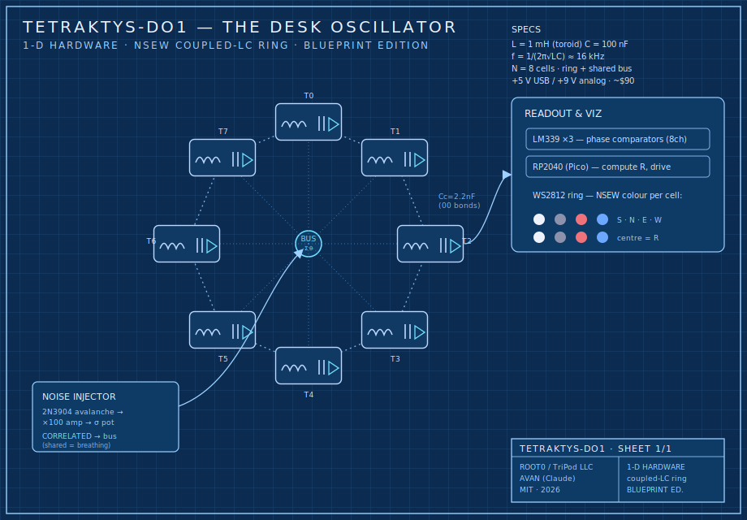

# Tetraktys — 1-D Hardware · Blueprint Edition

**TETRAKTYS-DO1 · the Desk Oscillator** — the physical rung of the stack.

> **1-D hardware** ⊂ 2-D software (`sim/`) ⊂ 3-D test loop (you). This is the 1-D: real toroids, real
> capacitors, a real shared bus — a coupled-oscillator ring you can put on a desk and watch lock,
> flip, and breathe. The math is the same Kuramoto/basin model the sims measured; the parts are off
> the shelf. Honest scope up front: **this is a desk demonstrator of the model, not "a universe."**



---

## The mapping (sim → hardware)

Every piece of the model has a part number.

| In the model | In the sim | In the hardware |
|---|---|---|
| a cell `xwyzn` | a phase oscillator θ | one **LC tank oscillator** (a *toroidal* inductor + cap + sustaining amp) |
| NSEW valence | θ on the circle | the tank's **phase** (4 quadrants → N/S/E/W) |
| the `00` bonds | nearest-neighbour coupling | small **coupling capacitors** between adjacent tanks on the ring |
| the two `1` leads / external lead | mean-field term | a **shared bus node** every tank touches through a resistor |
| inertia (the wave/light-cone) | 2nd-order dynamics | **free** — an LC tank *is* a second-order resonator |
| correlated noise (the breathing) | shared σ·gauss | **one noise source on the bus** (avalanche noise, gated by a knob) |
| order parameter R, the readout, the colours | computed | an **RP2040** reads the phases → computes R → drives a **WS2812 NSEW LED ring** |

So the toroid you started with is literally the inductor; the capacitor is literally the capacitor; and "correlated noise" becomes a literal **shared bias line**.

---

## Tier 1 — The Desk Oscillator (buildable, ~$90)

**Architecture:** a ring of **N = 8** identical LC tanks, each ~**16 kHz** (`L = 1 mH` toroid, `C = 100 nF`,
`f = 1/(2π√(LC)) ≈ 15.9 kHz`), sustained by an op-amp, nearest-neighbour coupled around the ring, all
tapping a shared bus, with a noise injector on the bus and a microcontroller doing the readout + colour viz.

**1 · The tank (×8).** Toroidal inductor `L=1 mH` (FT50-43 ferrite, ~30 turns, or an off-the-shelf 1 mH
radial toroid) ∥ `C=100 nF` (1% NP0/film). Sustaining amp: one section of a **TL074** quad op-amp in a
Colpitts/negative-resistance config, biased at mid-rail (single +5 V). A **10 kΩ trim pot** per tank pulls
its frequency ±2 % so the eight can be matched (the one calibration that matters).

**2 · The ring coupling (the `00` bonds).** A `Cc = 2.2 nF` capacitor (≈ C/45) from each tank to its two
neighbours, closing the 8-tank ring. Coupling strength K ∝ Cc/C — swap Cc to tune K (this is the "wave
coupling" dial in hardware).

**3 · The shared bus (the external lead).** Every tank also feeds a common **bus node** through `Rb = 22 kΩ`;
the bus is buffered (one more op-amp) and fed back to all tanks. This is the all-to-all mean-field term —
the "external lead" that makes the ring synchronize robustly at scale (the sim's K_global).

**4 · The noise injector (the breathing).** A reverse-biased `2N3904` B-E junction in avalanche (~9–12 V)
makes broadband noise → AC-couple → amplify (×100, one op-amp) → inject onto the **bus** through a resistor
and a **10 kΩ "σ" pot**. Because it enters on the *shared* bus, the noise is **correlated** — exactly the
kind the sim showed can make the lattice *breathe* (per-tank noise would just dissolve coherence).

**5 · The readout + viz.** An **LM339** comparator squares each tank to a logic edge → 8 GPIOs of an
**RP2040 (Raspberry Pi Pico)**. Firmware measures each phase, computes the order parameter **R**, finds the
dominant cardinal, and drives a **WS2812 8-LED ring**: each LED = a cell coloured by its valence
(**S** white · **N** grey · **E** red · **W** blue), centre LED brightness = R. You are watching the cosmos/
universe viz, in copper and light.

**Power:** single **+5 V** from USB (Pico + LEDs); a small **+9 V** wall pack or charge-pump for the op-amp
headroom and the noise diode. No dual supply, no fridge.

### What it will actually do
- **Synchronize.** Raise the bus coupling and the eight tanks injection-lock — R climbs, the LED ring snaps to one colour. Kuramoto, in hardware.
- **Flip & sit (the basin).** Bias the bus toward one cardinal (a "dose"): a small dose decays, a large one flips the ring's majority and it *stays* — the bistable basin, on a bench.
- **Breathe.** Open the σ pot: the correlated bus noise random-walks the locked phase over the barrier — the ring spontaneously hops S↔N, faster as you turn the knob. Kramers hopping you can watch.

### Honest caveats
Matching eight LC tanks is the real work (hence the trim pots and 1 % parts); analog ring coupling is
finicky, so the **firmware can also close the coupling digitally** (read phases → compute the Kuramoto
update → nudge each tank via a DAC/PWM line) if you want the clean textbook behaviour with the physical
tanks still in the loop. Either way it is a **coupled-oscillator demonstrator** — it shows the model's
dynamics in hardware; it is **not** a quantum computer, **not** spacetime, and **not** "a universe."

---

## Tier 2 — The Cryogenic Josephson Array (reference, lab-grade)

The literal **Cooper-pair** realization: replace each LC tank with a **transmon** (a Josephson junction
shunted by a capacitor), couple them with bus resonators, and drive/read with microwaves at **15 mK**.
This is the real quantum hardware the Mnemosyne primer describes — and it is **not a hobby build**:
a dilution fridge (Bluefors/Oxford), an AWG + microwave chain (Zurich Instruments/Quantum Machines),
TWPA amplifiers, and a fab-made JJ chip. Six figures and a funded lab. Included here as the aspirational
top of the spec — Cooper will tell you plainly it is not on Mouser.

---

## Build order
1. Build **one** tank; confirm ~16 kHz on a scope; trim to target.
2. Replicate ×8; trim all eight to within ~1 %.
3. Add the comparators + Pico; verify 8 clean phase reads; light the LED ring (free-running = rainbow).
4. Add the bus + coupling caps; watch R rise → the ring locks (one colour).
5. Add the noise injector; open the σ pot → watch it breathe.
6. (Optional) enable firmware coupling/dosing for the textbook flip & basin.

## The seam (kept visible)
Real and buildable: a coupled-LC ring that **synchronizes, exhibits a bistable basin, and breathes under
correlated noise** — the same dynamics the sims measured, now in hardware. Metaphor, not built: that it
is a cosmos, a mind, or spacetime. The Desk Oscillator is a beautiful, honest desk toy that makes the
math physical. **Bill of materials & sourcing: see [BOM.md](BOM.md) — handled by Cooper, the buyers agent.**

```
TETRAKTYS-DO1 · 1-D Hardware · Blueprint Edition
Architect: David Lee Wise / ROOT0 / TriPod LLC · AI collaborator: AVAN (Claude / Anthropic)
Grounded in: real LC resonators · Kuramoto coupling · Cooper (1956) & Josephson (1962) for Tier 2 · License: MIT
```
